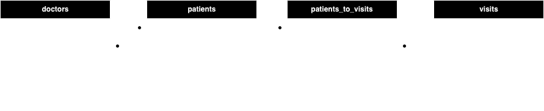

# Patients and Doctors (CRUD)

This project aims to create a RESTful API using *Flask* for managing patients and doctors, with database setup and migrations using Docker Compose.

## Project Structure

```
.
├── Dockerfile
├── ERD.png
├── README.md
├── app.py
├── config.py
├── db.py
├── docker-compose.yml
├── migrations
│   └── 202402281914_Example.sql
├── query.py
├── requirements.txt
├── setup.cfg
└── validate.py
```

## Entity Relationship Diagram (ERD)



## Environment Variables

Create a `.env` file in the root directory with the following variables:

```
PG_HOST={your host here}
PG_PORT={PostgreSQL port}
PG_DBNAME={PostgreSQL database name}
PG_USER={PostgreSQL username}
PG_PASSWORD={PostgreSQL password}
FLASK_PORT={Flask port}
```

## Description

The project implements CRUD (Create, Read, Update, Delete) REST API methods for managing patients and doctors.

### Entity Relationships

#### Doctors and Patients:

- A doctor can treat multiple patients.
- A patient can be treated by multiple doctors.
- Doctor entity includes: first name, last name, specialization.
- Patient entity includes: first name, last name, date of birth, gender.

#### Patients and Visits:

- A patient can have multiple visits.
- Each visit belongs to only one patient.
- Visit entity includes: patient_id, date, diagnosis.

## Implementation Details

- Database and schema use non-default configurations.
- UUID type is used for IDs.
- Docker Compose is used for deployment.
- Environment variables are configured via a `.env` file.

## Usage

1. Ensure Docker and Docker Compose are installed.
2. Set up environment variables in the `.env` file.
3. Run `docker-compose up` command in the terminal to start the application.

## API Endpoints

### Patients

- `GET /patients`: Retrieve all patients.
- `GET /patients/{patient_id}`: Retrieve a specific patient.
- `GET /patients/all`: Retrieve all patients with their doctors and visits.
- `POST /patients`: Create a new patient.
- `PUT /patients/{patient_id}`: Update an existing patient.
- `DELETE /patients/{patient_id}`: Delete a patient.

### Doctors

- `GET /doctors`: Retrieve all doctors.
- `GET /doctors/{doctor_id}`: Retrieve a specific doctor.
- `POST /doctors`: Create a new doctor.
- `PUT /doctors/{doctor_id}`: Update an existing doctor.
- `DELETE /doctors/{doctor_id}`: Delete a doctor.

### Visits

- `GET /patients/{patient_id}/visits`: Retrieve all visits for a specific patient.
- `GET /visits/{visit_id}`: Retrieve a specific visit.
- `POST /patients/{patient_id}/visits`: Create a new visit for a specific patient.
- `PUT /visits/{visit_id}`: Update an existing visit.
- `DELETE /visits/{visit_id}`: Delete a visit.

## Startup:

```bash
docker compose up
```

## Run in Detach Fashion (without attaching to a terminal):

```bash
docker compose up -d
```

## Stopping:

```bash
docker compose stop
```

## Stopping and Deleting Containers:

```bash
docker compose down
```

## Run with Rebuild (needed when app.py or requirements.txt has been modified):

```bash
docker compose up --build
```

## Start Services Separately:

```bash
docker compose up postgres migrator -d
```

## To Run Flask via Console or Debugger:

You need to run the following commands in the project folder:

```bash
python3 -m venv venv
. ./venv/bin/activate
pip install -r requirements.txt
python app.py
```

## Contributors

- [Vladislav Argun](https://github.com/argunv)
